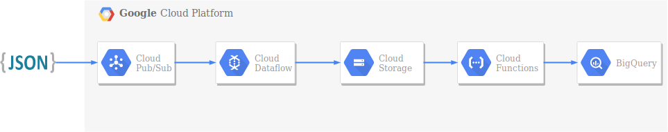

# Wikipedia Streams

Exemplo de uma implementação `stream` de eventos do Wikipedia, postando no Google Gloud Platform.

## Architecture


1. Evento de mudança de informação do Wikipedia, gera um arquivo no formato JSON.
2. A mensagem gerada é lida e postada no Cloud Pub/Sub.
3. As mensagens postadas no Cloud Pub/Sub, são processadas via Cloud Dataflow e armazenadas no Cloud Storage.
4. Para cada arquivo materializado no Cloud Storage, o trigger do Cloud Functions realiza o _load_ dos dados no BigQuery. 

## Service Account

No Google Cloud Console, gere e faça _download_ de uma `service account` com permissão de administrador para postar as mensagens no Pub/Sub.

## Setup
 
Na pasta `setup`, edite o arquivo `project.env` com a definição das variáveis de ambiente do seu projeto, em seguida execute: `source setup/project.env`.

```
    export GOOGLE_APPLICATION_CREDENTIALS=/home/Downloads/your-service-account.json
    export PROJECT_ID=my-project-id
    export TOPIC_ID=wikipedia-stream
```

## Cloud Storage

No Google Cloud Console, acesse o Cloud Storage, e crie 02 (dois) _buckets_:

1. Crie o bucket aonde as mensagens serão armazenadas: `gs://wikipedia-messages`.
2. Crie o bucket que servirá para fazer o _deploy_ da _function_: `gs://setup`.
3. Faça _upload_ do arquivo `setup/function.zip` para o bucket: `gs://setup`.

## Cloud Function

Faça o _deploy_ da _function_ executando o comando abaixo, via Google Cloud Shell.

```
    gcloud functions deploy my-function-name \
    --region us-east1 \
    --runtime python37 \
    --entry-point gcs2bigquery \
    --trigger-resource wikipedia-messages \
    --trigger-event google.storage.object.finalize \
    --source gs://setup/function.zip \
    --set-env-vars PROJECT_ID=my-project_id,DATASET_ID=wikipedia,TABLE_ID=change_events
```

## Stream

1. Acesse a pasta `stream`.
2. Instale as dependências: `pip3 install -r requirements.txt`
3. Execute: `python3 stream.py`

## Cloud Dataflow

No Google Cloud Console, acesse o Cloud Dataflow, e inicie o _template job_ definido como `Cloud Pub/Sub to Text Files on Cloud Storage`, com os seguintes argumentos:

1. Nome do Job: `wikipedia-stream`.
2. Input Cloud Pub/Sub topic: `projects/<my-project-id>/topics/wikipedia-stream`.
3. Output Cloud Storage directory: `gs://wikipedia-messages/`.
4. Output file prefix: `wikipedia-`.
5. Local temporário: `gs://setup/tmp`.
6. Output file suffix: `.json`.

## BigQuery

Finalmente, após o fechamento da primeira janela de 5 minutos de processamento do Cloud Dataflow, será possível consultar os dados na tabela.

## References
- https://medium.com/google-cloud/import-json-into-bigquery-with-google-cloud-functions-31facea134bf
- https://www.mediawiki.org/wiki/Manual:RCFeed
- https://pypi.org/project/sseclient/

## API References
- https://googleapis.github.io/google-cloud-python/latest/
- https://github.com/GoogleCloudPlatform/python-docs-samples/
- https://cloud.google.com/functions/docs/how-to
- https://cloud.google.com/sdk/gcloud/reference/beta/functions/deploy
- https://cloud.google.com/dataflow/docs/templates/executing-templates#modelos-fornecidos-pelo-google
